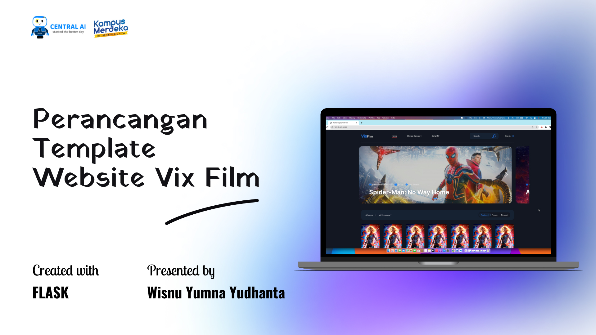

# Personal Portfolio | NiceProg



## Introduction
Welcome to my personal portfolio website! This project showcases my skills, experience, and projects I've worked on. As a graduate of Applied Science in Informatics Engineering with extensive experience in software development, I'm excited to share my work with you.

## Table of Contents
- [Introduction](#introduction)
- [Features](#features)
- [Installation](#installation)
- [Usage](#usage)
- [Screenshots](#screenshots)
- [Contact](#contact)

## Features
- **Responsive Design**: Optimized for all devices.
- **Animated Scrolling**: Smooth scrolling between sections.
- **Project Slider**: Showcase projects using a slider.
- **Interactive Navigation**: Easy navigation with scroll-to-top button.
- **Dynamic Content**: Typed.js for dynamic text animation.

## Installation
To run this project locally, follow these steps:

1. **Clone the repository:**
   ```sh
   git clone https://github.com/niceProg/personal-portfolio.git
